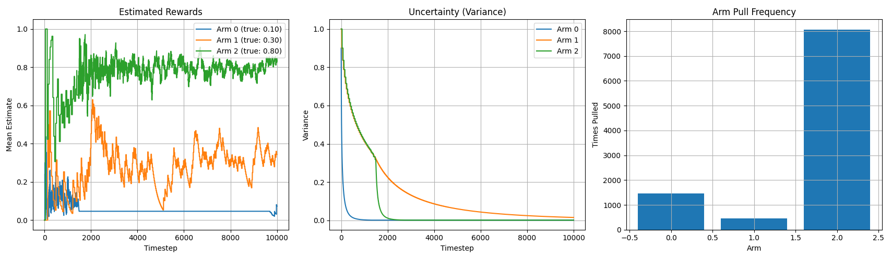

(This baby "research project" was framed and solved with Microsoft Copilot... and some feedback from an actual human). I'm not an expert in AXIOM algorithm, but the code seems to work.
Here are its result (described by itself). I find it interesting that it can help framing a specific problem, and implement the coding part.


# axiom-bandit-controller

An adaptive agent based on Active Inference principles, capable of aligning long-term behavior with internal goals—even when no single action satisfies them. Inspired by the AXIOM framework, this implementation introduces a minimal trajectory-aware control loop to regulate cumulative reward toward a target value through dynamic policy mixing.

## 🌐 Motivation

Standard AXIOM agents select actions by minimizing expected free energy (EFE), seeking arms that match their internal goal (e.g. reward ≈ 0.5). However, when no arm delivers the target directly, traditional inference collapses onto the "least-bad" option, leaving the agent unable to regulate its long-term outcome.

This project solves that limitation.

## 🧠 Key Insight

Modify the agent’s behavior with a single control term:
```python
pragmatic = (self.internal_goal - np.mean(self.all_rewards)) * self.means
```

## 📈 Simulation Result: Goal Alignment at 0.67

The agent was tested on a 3-armed bandit with true reward probabilities:

```python
true_means = [0.1, 0.3, 0.8]
goal = 0.67
```

Using a trajectory-aware control loop, the agent dynamically regulated its behavior over 10,000 simulation steps, achieving an empirical average reward of:
```python
Final reward ≈ 0.671
```

This confirms precise long-term goal alignment—even though none of the individual arms delivers the target reward directly.

## 🖼️ Visualization
Reward Convergence to Goal



The plot shows:
- The estimated rewards for each arm
- Arm variances
- The final histogram of arm selection
  
## ⚙️ Key Mechanism
The agent used a modified AXIOM policy with a single control line:
```python
pragmatic = (self.internal_goal - np.mean(self.all_rewards)) * self.means
```

This dynamically adjusts the agent's preferences based on cumulative performance, allowing composite behavior to emerge through implicit policy mixing.
